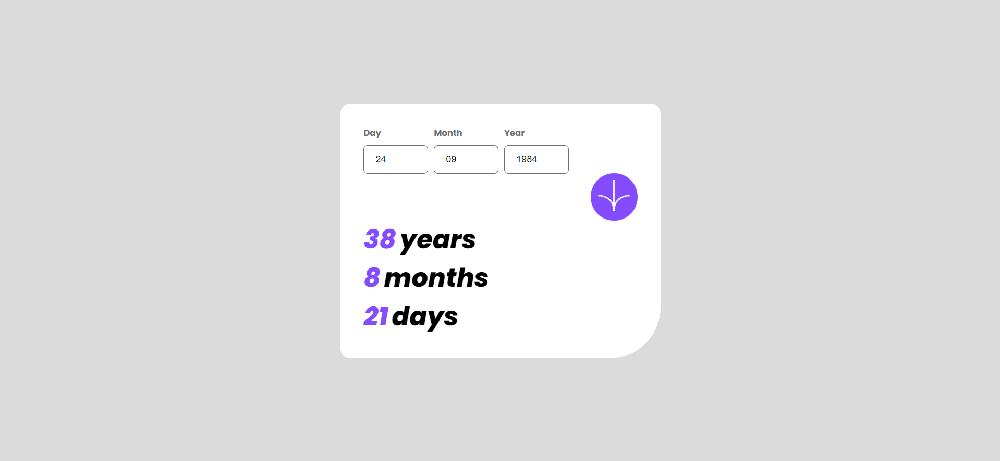

## Overview

### Age Calculator App

Users should be able to:

- View an age in years, months, and days after submitting a valid date through the form
- Receive validation errors if:
  - Any field is empty when the form is submitted
  - The day number is not between 1-31
  - The month number is not between 1-12
  - The year is in the future
  - The date is invalid e.g. 31/04/1991 (there are 30 days in April)
- View the optimal layout for the interface depending on their device's screen size
- See hover and focus states for all interactive elements on the page
- **Bonus**: See the age numbers animate to their final number when the form is submitted

### Screenshot

### Links

+ Live Site URL: [Solution URL](https://unaygney.github.io/ageCalculatorApp/)
+ Solution URL:  [Live site URL](https://www.frontendmentor.io/solutions/age-calculator-app-tzfiaTM0d1)

### Built with

- Semantic HTML5 markup
- CSS custom properties
- Flexbox
- CSS Grid
- Mobile-first workflow

### What I learned

- Use this section to recap over some of your major learnings while working through this project. Writing these out and providing code samples of areas you want to highlight is a great way to reinforce your own knowledge.

- I had a hard time writing the javascript part of this code. I took help from Stack Overflow and chatGBT. I saw my missing parts. It was a good app for my development. I will study more javascript

## Author

- Frontend Mentor - [@unaygney](https://www.frontendmentor.io/profile/unaygney)
- Twitter - [@guneyunay](https://www.twitter.com/guneyunay)

